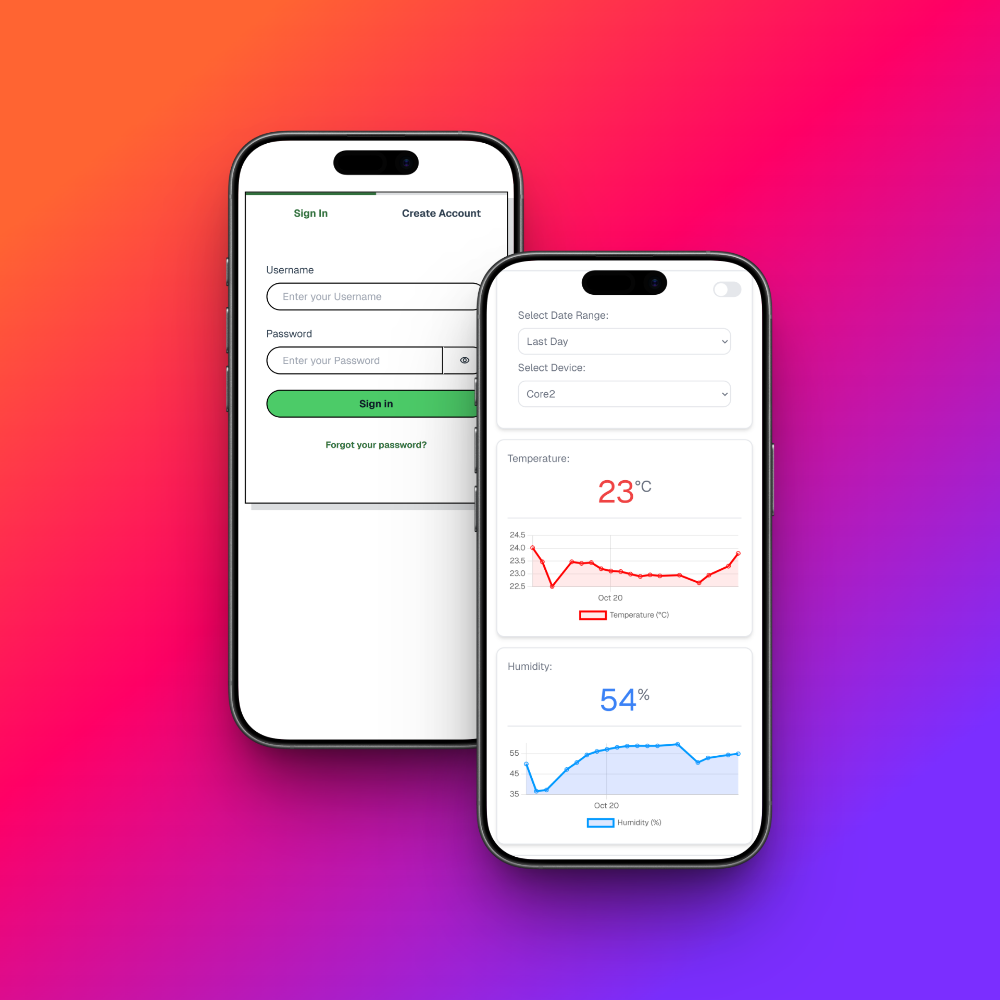
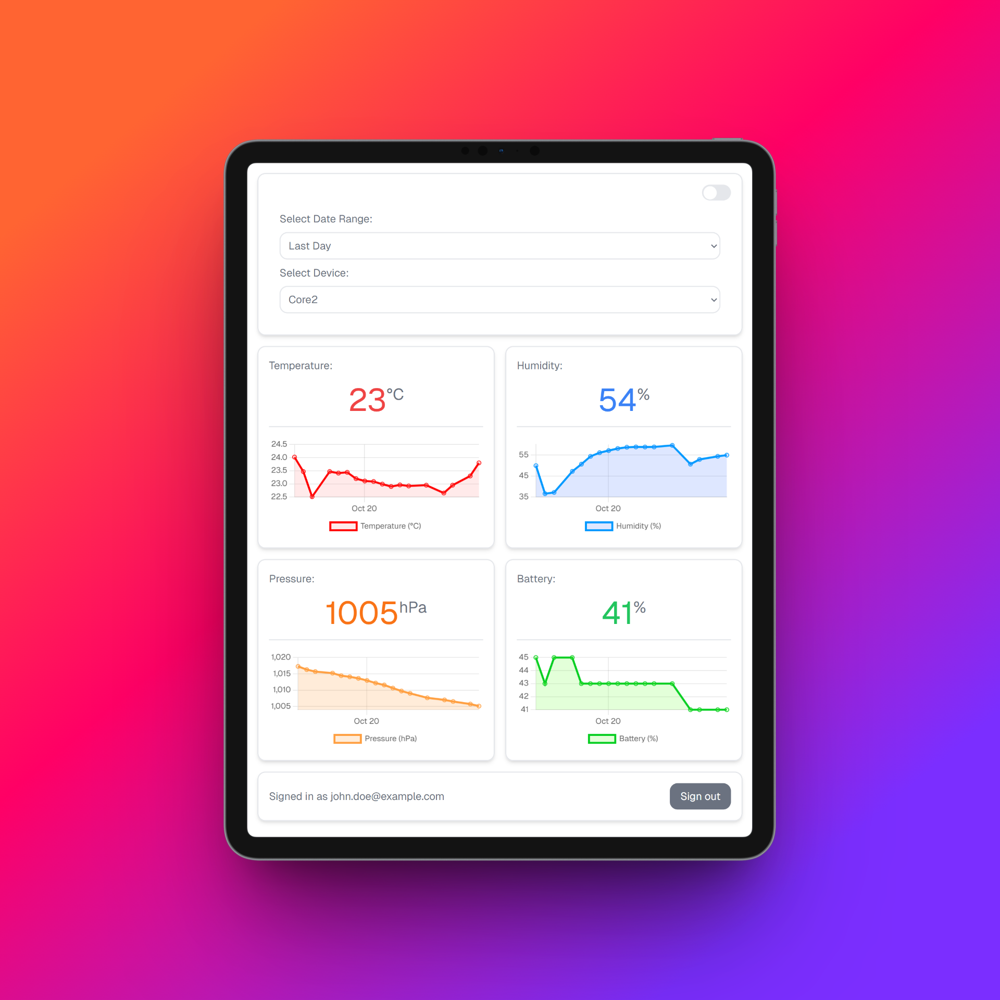
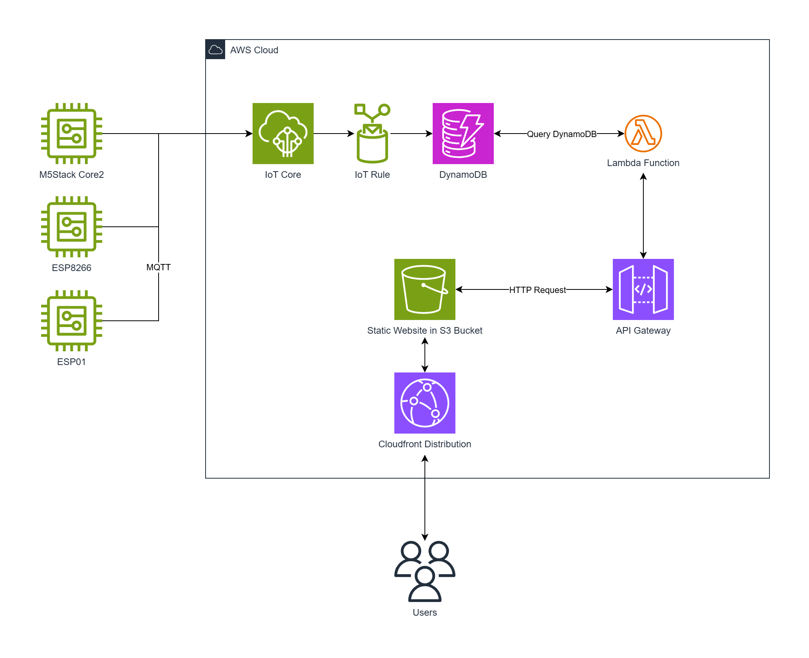

# IoT Platform

This repository contains everything necessary to spin up a fully functioning IoT platform including configuration of edge devices, fully functional AWS backend and Next.js frontend. All AWS service usage is within the free tier range. Deploying and running this project costs exactly 0$.

  
  

## Architecture

The resources deployed in the AWS cloud will enable storing and retrieval of the IoT sensor data. An IoT rule inserts all data published to a certain MQTT topic into multiple columns of a DynamoDB table. Via a POST request to a REST ApiGateway a lambda function can be triggered to query the database table and return all data from a specified time interval.

## Getting Started

### Sensors

Follow the instructions of the `README.md` in the respective sensor type's directory in the `edge/` folder.

### Deploying Frontend & Backend

Prerequisites:

- Node
- AWS CLI
- AWS CDK

Use the Makefile to deploy the application:

- Run `make backend` to build and deploy the AWS backend. This will run `cdk deploy`.
- Run `make frontend` to build and deploy the Next.js frontend. This will run `npm run build` and upload the static website files to an S3 bucket.

or:

- Run `make app` to deploy both